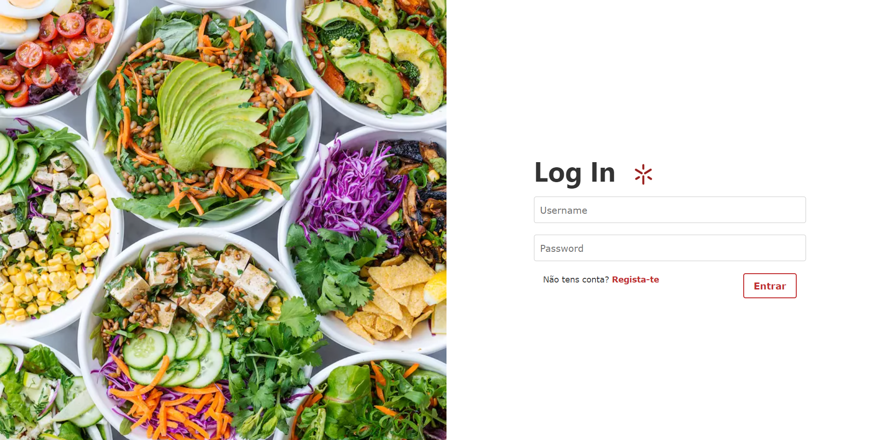
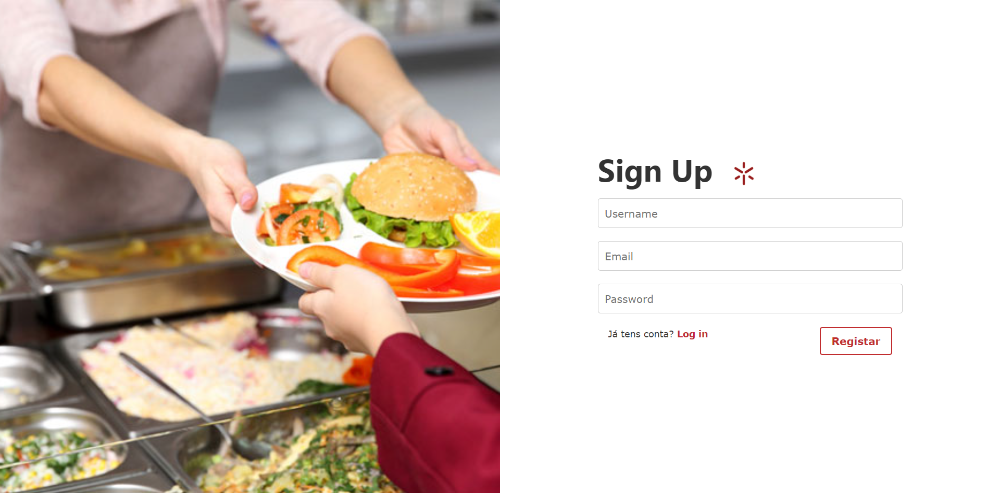
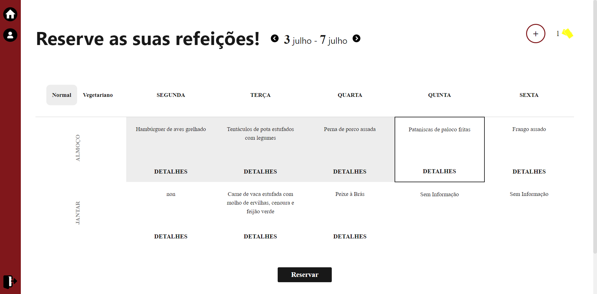
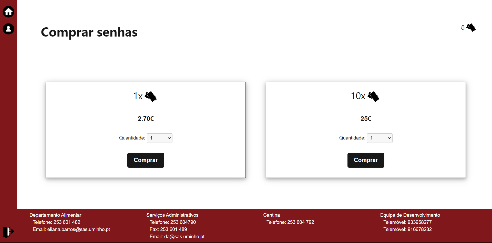
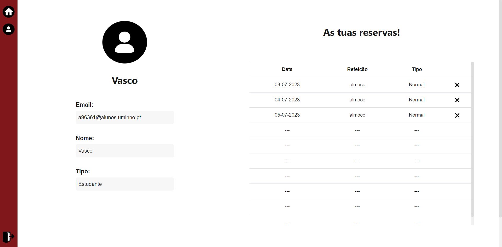
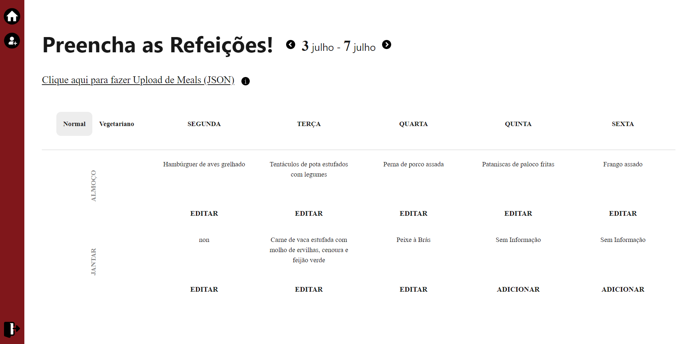
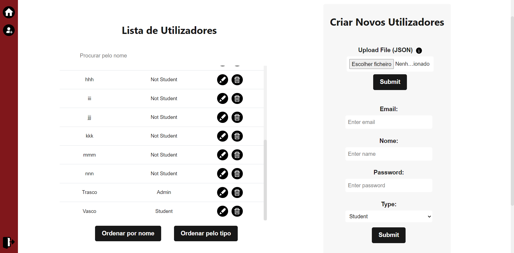
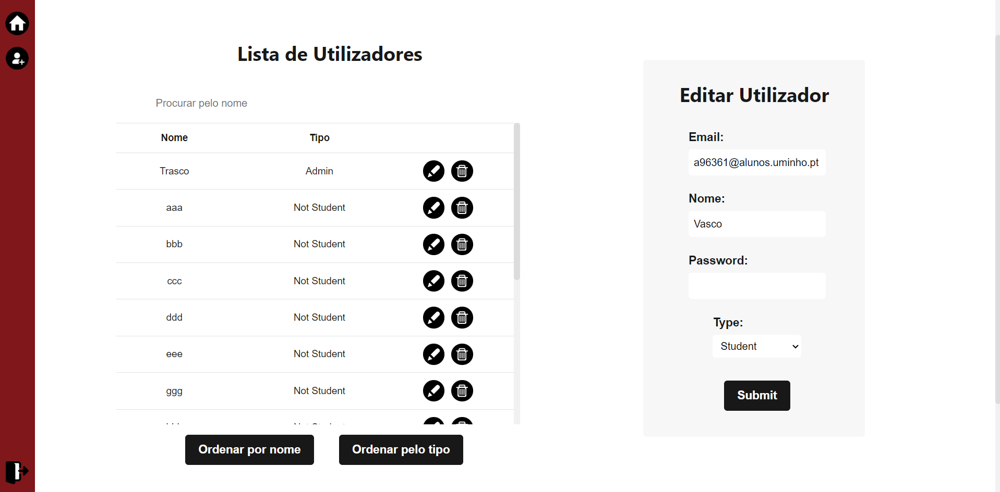
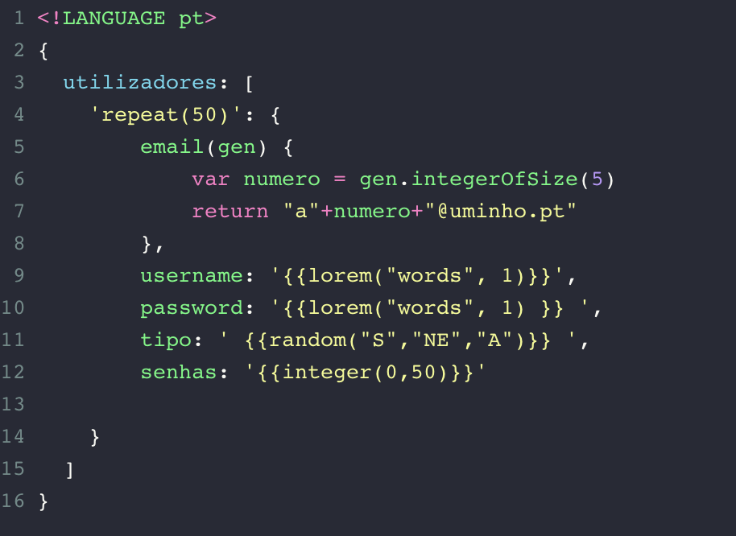
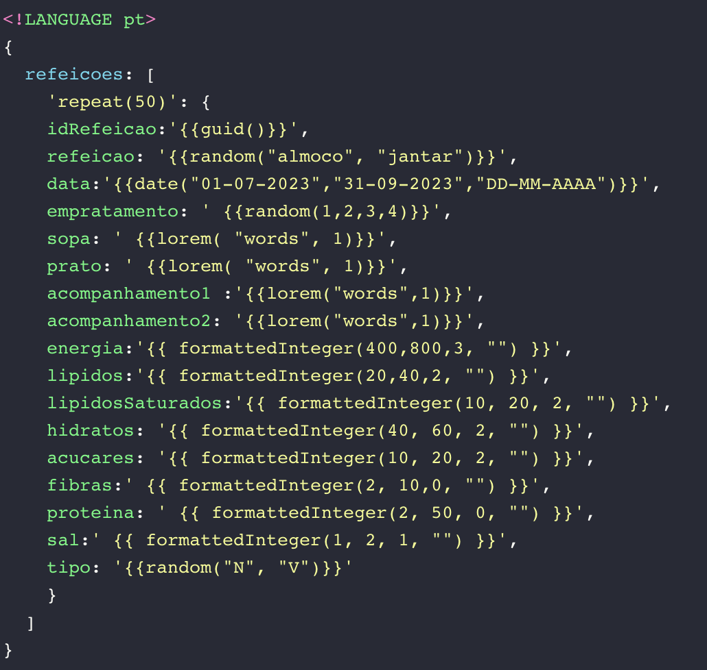

## grupo
| Número | Nome             |
| 96434  | Francisca Barros |
| 93870  | Rafael Correia   |
| 96361  | Vasco Oliveira   |

# Índice

  

  

- [Índice](#índice)
- [Introdução](#introdução)
	- [Um belo Projeto](#um-belo-projeto)
- [Análise e Especificação](#análise-e-especificação)
	- [Descrição informal do problema](#descrição-informal-do-problema)
	- [Levantamento de Requisitos](#levantamento-de-requisitos)
		- [Requisitos Mínimos](#requisitos-mínimos)
		- [Requisitos Extra](#requisitos-extra)
- [Estrutura/Desenvolvimento](#estruturadesenvolvimento)
	- [Autenticação](#autenticação)
	- [API de Dados](#api-de-dados)
		- [meals.js:](#mealsjs)
		- [reserves.js:](#reservesjs)
		- [users.js:](#usersjs)
	- [Interface](#interface)
- [Interface](#interface-1)
	- [Páginas de Autenticação](#páginas-de-autenticação)
	- [Páginas para Utilizadores](#páginas-para-utilizadores)
	- [Páginas para Administradores](#páginas-para-administradores)
- [Datasets](#datasets)
		- [Dataset Utilizadores](#dataset-utilizadores)
		- [Dataset Refeições](#dataset-refeições)
- [Modo de funcionamento](#modo-de-funcionamento)
- [Conclusão](#conclusão)

  

  

# Introdução

  

  

## Um belo Projeto

  

  

O presente relatório descreve o trabalho prático realizado no âmbito da Unidade Curricular de Engenharia Web, inserida no curso de Licenciatura em Engenharia Informática durante o 2º Semestre do ano letivo 2022/2023.

  

  

Neste projeto, o grupo optou por escolher o seu próprio tema, que consiste na criação de uma plataforma para ver a ementa da cantina, fazer reservas e comprar senhas.

  

  

O objetivo deste trabalho é desenvolver uma plataforma com dois tipos distintos de utilizadores: os alunos e os administradores. Aonde os alunos podem comprar senhas, ver a ementa e reservar refeições e os administradores podem criar, editar e apagar utilizadores e colocar novas refeições na ementa.

  

  

O relatório está dividido em várias secções. Iniciamos com a introdução, que apresenta uma visão geral do trabalho realizado. Em seguida, abordamos a análise e especificação, onde descrevemos informalmente o problema a ser resolvido e estabelecemos os requisitos necessários para a sua resolução. Posteriormente, apresentamos a estrutura/desenvolvimento do projeto, mostrando como o projeto está estruturado a níveis de codificação. Prosseguimos por mostrar várias prints da interface da nossa plataforma e de seguida falamos dos datasets usados. Por fim, mostramos como é que se põe o projeto a correr e concluímos o relatório com uma síntese das principais conclusões obtidas ao longo do projeto.

  

  

O objetivo final deste trabalho é fornecer uma plataforma que os alunos da Universidade do Minho possam usar no seu dia a dia para que a experiência de ir à cantina seja melhor, também queremos que a nossa plataforma seja facil de usar e entender para os administradores que terão de eventualmente usá-la para introduzir os menus semanais.

  

  

---

  

  

# Análise e Especificação

  

  

## Descrição informal do problema

  

  

O objetivo deste trabalho é desenvolver uma plataforma com dois tipos distintos de utilizadores: os alunos e os administradores. Os alunos poderão comprar senhas, consultar o menu e fazer reservas para as refeições, enquanto os administradores poderão criar, editar e eliminar utilizadores, bem como adicionar novas refeições ao menu.

  

  

## Levantamento de Requisitos

  

  

### Requisitos Mínimos

  

  

- [x] O sistema deverá estar protegido com autenticação: username+password, (chaveAPI, google, facebook...)

  

- [x] Deverá ser possível criar uma nova conta, através do registo, onde será preciso fornecer um username, um email e uma password para criar a conta.

  

- [x] Deverão existir pelo menos 2 níveis de acesso:

  

	- Administrador - pode adicionar e alterar refeições e utilizadores;

  

	- Utilizador - pode comprar senhas, reservar refeições e alterar alguns atributos do seu perfil;

  

- [x] O utilizador poderá comprar senhas e usá-las para reservar refeições. Cada refeição só poderá ser reservada uma vez, podendo reservar múltiplas senhas ao mesmo tempo.

  

- [x] Antes de reservar, o utilizador poderá especificar se a refeição é normal ou vegetariana, e deverá conseguir ver todos os detalhes de cada refeição.

  

- [x] As senhas podem ser compradas separadamente ou num pack de 10 senhas, sendo que uma senha separada custa 2.70€ mas um pack de 10 senhas custa 25€.

  

- [x] O utilizador deve conseguir aceder ao seu próprio perfil onde poderá consultar as reservas e os seus atributos.

  

- [x] O administrador poderá adicionar refeições diretamente pela plataforma em si para todos os utilizadores de seguida poderem reservar, só podendo adicionar uma refeição normal e uma vegetariana por cada dia.

  

- [x] O administrador terá acesso a um form onde é disponibilizada uma tabela com todos os utilizadores da plataforma, podendo editá-los ou apagá-los e poderá criar utilizadores novos com os atributos que quiser.

  

  

### Requisitos Extra

  

  

- [x] Se o utilizador tiver sido registado através da página de registo este será considerado "Not Student"
  

- [x] Ter preços diferentes para os tipos de utilizador diferentes.

- [ ] Caso o utilizador ou administrador se esqueça da password da sua conta poderá recuperá-la através de uma funcionalidade onde é mandado um email para o email associado à sua conta, podendo, assim, alterar a password através do email mandado.

  

- [x] O website deverá ter uma barra de navegação para o utilizador poder navegar facilmente entre as diferentes funcionalidades

  

- [x] O website deverá ter um footer com todas as informações e meios possíveis de um utilizador conseguir contactar a equipa de desenvolvimento, para problemas técnicos que possam ter com a plataforma, e a cantina, para questões relacionadas com a cantina em si.

  

- [ ] O utilizador no seu perfil deverá poder atualizar a sua imagem de perfil.

  

- [x] O utilizador no seu perfil poderá cancelar reservas em qualquer altura que preceda o dia da reserva.

  

- [ ] O utilizador poderá mudar o website para darkmode, onde o website reduz a luz emitida pela tela do respetivo dispositivo.

  

- [x] O administrador poderá editar as refeições previamente adicionadas, mostrando um aviso caso a refeição que esteja a ser editada esteja a ser disponibilizada para todos os utilizadores.

  

- [x] O administrador poderá adicionar múltiplos utilizadores e refeições através do upload de um ficheiro JSON

  

- [x] Quando é registado um novo utilizador este recebe um email de confirmação para validar a sua conta, só após a validação é que este pode fazer login

  

- [x] Possibilidade de selecionar semanas futuras ou passadas

  

- [x] O utilizador não pode reservar dias que já passaram, nem pode fazer várias reservas para o mesmo dia e mesma refeição (almoço ou jantar)
- [x]  Com o auxílio do Docker, possibilidade de esconder operações sobre a base de dados aos utilizadores.
- [ ] Com ajuda de uma API externa ter um sistema real de pagamento para a compra de senhas 

  

  

É de notar, tal como já foi dito, que estes requisitos foram feitos para nos conseguirmos orientar e, como tal, é possível que alguns dos requisitos podem não ter sido feitos, ou por questões de tempo ou porque não achamos que seriam necessários para fornecer uma melhor experiência ao utilizador.

  

  

---

  

  

# Estrutura/Desenvolvimento

  

  

Neste Capítulo iremos falar de como o projeto foi estruturado e mostrar o seu desenvolvimento em termos de codificação. Este projeto foi estruturado entre três sub-aplicações:

  

  

1. Autenticação: Nessa parte, foi implementado um sistema de autenticação para garantir a segurança da plataforma. A autenticação é necessária para garantir que apenas utilizadores autorizados possam acessar a plataforma e realizar ações específicas, de acordo com os seus níveis de acesso. Para gerir os utilizadores e as respetivas sessões são utilizados os módulos *passport-local* e *jsonwebtoken*. O módulo *jsonwebtoken* é apenas utilizado para a geração de um token que irá identificar a sessão do utilizador. Este token será utilizado pela interface como uma cookie.

  

2. API de Dados: A API de Dados foi desenvolvida para lidar com o armazenamento e gerenciamento dos dados da plataforma. Foi utilizado uma base de dados, através do software MongoDB, para armazenar informações dos utilizadores, refeições e reservas. A API fornece endpoints para a criação, leitura, atualização e exclusão de dados, permitindo que a plataforma interaja com a base de dados de forma segura e eficiente.

  

3. Interface: Foi projetada uma interface amigável e intuitiva, com layouts e componentes adequados para facilitar a interação dos utilizadores com a plataforma. Foram utilizadas tecnologias web, como Pug, CSS e JavaScript. A interface permite que os utilizadores possam interagir com a plataforma, podendo realizar o login e o registo, visualizar a ementa da cantina, comprar senhas, reservar refeições e ver o seu perfil, e os que forem administradores, criar novos utilizadores e refeições.

  

  

Cada uma dessas partes desempenha um papel fundamental no funcionamento da plataforma, trabalhando em conjunto para poder funcionar na totalidade. A estruturação em três partes distintas permite que o projeto seja dividido em módulos independentes, facilitando o desenvolvimento, manutenção e escalabilidade da plataforma.

  

  

## Autenticação

  

  

A Autenticação possui várias rotas e funcionalidades relacionadas à autenticação e manipulação de utilizadores. A seguir, apresento uma breve descrição de cada rota e funcionalidade:

  

  

- A função de middleware `auth.verificaAcesso` verifica se o utilizador tem acesso autorizado e guarda o *username* do mesmo, sendo usada por várias rotas.

  

- A rota GET `/` retorna a informação de que a autorização é bem-sucedida, juntamente com o ID do utilizador, verificando se a pessoa está logged in. Usa o middleware `auth.verificaAcesso` para verificar a autorização do utilizador.

  

- A rota GET `/token` retorna informações do utilizador com base no token correspondente à sua sessão. Usa o middleware `auth.verificaAcesso` para verificar a autorização do utilizador e para extrair o *username* do utilizador (para depois procurar na base de dados).

 

  

- A rota POST `/register` cria um novo utilizador utilizando o modelo do utilizador (`userModel`) e a senha fornecida.

  

- A rota POST `/login` realiza o login do utilizador usando o método de autenticação `passport.authenticate('local')`. Gera um token JWT contendo o nome de utilizador (`req.user.username`) e com duração de 1 hora (3600 segundos).

  

  

  

## API de Dados

  

  

A API de dados esta dividida em 3 arquivos que mexem com a sua respetiva collection, estando as suas rotas representadas a seguir.

  

  

### meals.js:

  

  

- A rota GET `meals/` retorna uma lista de refeições. Chama a função `Meal.list()` do controlador meal para obter os dados das refeições.

  

- A rota GET `meals/:id` retorna uma refeição com o ID fornecido. Chama a função `Meal.getMeal(id)` do controlador `meal.js` para obter os dados da refeição.

  

- A rota GET `meals/date/:date` retorna uma refeição com base na data fornecida. Chama a função `Meal.getMealDate(date)` do controlador `meal.js` para obter os dados da refeição.

  

- A rota POST `meals/` adiciona uma nova refeição com base nas informações fornecidas. Chama a função `Meal.addMeal(meal)` do controlador `meal.js` para adicionar a refeição.

  

- A rota PUT `meals/:tipo/:data` atualiza uma refeição com base no tipo e data fornecidos. Chama a função `Meal.editMealDate(date, tipo, meal)` do controlador `meal.js` para atualizar a refeição.

  

- A rota DELETE `meals/:id` remove a refeição com o ID fornecido. Chama a função `Meal.deleteMeal(id)` do controlador `meal.js` para remover a refeição.

  

  

### reserves.js:

  

  

- A rota GET `reserves/` retorna uma lista de reservas. Chama a função `Reserve.list()` do controlador `reserve.js` para obter os dados das reservas.

  

- A rota GET `reserves/:id` retorna uma reserva com o ID fornecido. Chama a função `Reserve.getReserve(id)` do controlador `reserve.js` para obter os dados da reserva.

  

- A rota GET `reserves/user/:idUser` retorna as reservas de um determinado utilizador com base no ID do utilizador fornecido. Chama a função `Reserve.getUserReserves(idUser)` do controlador `reserve.js` para obter as reservas do utilizador.

  

- A rota POST `reserves/` adiciona uma nova reserva com base nas informações fornecidas. Chama a função `Reserve.addReserve(reserve)` do controlador `reserve.js` para adicionar a reserva.

  

- A rota PUT `reserves/:id` atualiza uma reserva com o ID fornecido. Chama a função `Reserve.editReserve(id, reserve)` do controlador `reserve.js` para atualizar a reserva.

  

- A rota DELETE `reserves/:id` remove a reserva com o ID fornecido. Chama a função `Reserve.deleteReserve(id)` do controlador `reserve.js` para remover a reserva.

  

  

### users.js:

  

  

- A rota GET `users/` retorna uma lista de utilizadores. Chama a função `User.list()` do controlador `user.js` para obter os dados dos utilizadores.

  

- A rota GET `users/:id` retorna um utilizador com o ID fornecido. Chama a função `User.getUser(id)` do controlador `user.js` para obter os dados do utilizador.

  

- A rota POST `users/` adiciona um novo utilizador com base nas informações fornecidas. Chama a função `User.addUser(user)` do controlador `user.js` para adicionar o utilizador.

  

- A rota PUT `users/:id` atualiza um utilizador com o ID fornecido. Chama a função `User.editUser(id, user)` do controlador `user.js` para atualizar o utilizador.

  

- A rota DELETE `users/:id` remove o utilizador com o ID fornecido. Chama a função `User.deleteUser(id)` do controlador `user.js` para remover o utilizador.

  

  

## Interface

  

  

O arquivo `index.js` começa importando as dependências necessárias, incluindo o Express, o Axios para fazer requisições HTTP, o Moment.js para manipulação de datas e horários, o middleware de autenticação, o UUID para gerar identificadores únicos, o Multer para upload de arquivos e o fs para operações no sistema de arquivos.

  

  

O código define várias rotas usando o objeto `router` fornecido pelo Express:

  

  

- A rota GET `/` renderiza a página de login.

  

- A rota GET `/signup` renderiza a página de registo.

- A rota GET `/confirm/:id` é a rota seguida para validar uma conta e redireciona para a página do login.

- A rota GET `/logout` limpa o cookie do token e redireciona para `/?info=logout`.

  

- A função de middleware `getListMeals` recupera uma lista de refeições para uma determinada semana e armazena-as no objeto `req.listMeals`, sendo usada por várias rotas.

  

- A função de middleware `getListMealsandReserves` combina a funcionalidade de `getListMeals` e também recupera as reservas para o utilizador autenticado. Ela é usada pela rota da página inicial (`home`).

  

- A rota GET `/home` renderiza a página inicial. Ela requer autenticação e usa o middleware `getListMealsandReserves` para buscar os dados necessários para renderização.

- A rota GET `/home/senhas/:n` é utilizada quando são feitas reservas de refeições e serve para diminuir o número de senhas do utilizador consoante as reservas feitas, redirecionando de seguida para a página inicial. Requer autenticação.

  

- A rota GET `/buy` renderiza a página de compra. Ela requer autenticação.
- 
- A rota GET `/buy/:n` é utilizada quando é feita uma compra de senhas e serve para atualizar o número de senhas do utilizador, de seguida redireciona para página de compra. Ela requer autenticação.

  

- A rota GET `/adminhome` renderiza a página inicial do administrador. Ela requer autenticação de administrador e usa o middleware `getListMeals` para buscar os dados necessários.

  

- A rota GET `/profile` renderiza a página de perfil. Ela requer autenticação e recupera as informações do utilizador e as reservas do utilizador autenticado.
- A rota GET `/profile/reserve/:id`  é utilizada quando o utilizador remove uma reserva, no seu perfil, remove a reserva e incrementa o número de senhas do utilizador. Redireciona para a página do perfil e necessita de autenticação.

  

- A rota GET `/form` renderiza a página de formulário do utilizador. Ela requer autenticação de administrador e recupera uma lista de utilizadores.

  

- A rota GET `/form/edit/:id` renderiza a página de edição de formulário do utilizador. Ela requer autenticação de administrador e recupera as informações de um utilizador específico e a lista de todos os utilizadores.

- A rota GET `/form/delete/:id` requer autenticação de administrador e apaga o utilizador correspondente ao id passado em parâmetro. Redireciona para a página de formulário do utilizador.

- A rota POST `/` trata do login de um. utilizador. Ela opera o middleware `auth.login` para iniciar sessão do utilizador, colocando um cookie com o respetivo token de sessão.  

- A rota POST `/signup` trata do registro de utilizador. Ela opera o middleware `auth.signup` para criar um novo utilizador.

 - A rota POST `/home/reserve` serve para adicionar uma reserva à base de dados.

- A rota POST `/form` trata da criação de utilizador a partir do formulário de administrador. Ela opera o middleware `auth.signup` para criar um novo utilizador.

  

- A rota POST `/form/file` trata do upload de arquivos a partir do formulário de administrador. Ela lê o arquivo JSON e cria utilizadores com base nos dados do arquivo.

  

- A rota POST `/form/edit/:id` trata da edição de utilizador a partir do formulário de administrador. Ela exclui o utilizador com o ID fornecido e opera o middleware `auth.signup` para criar um novo utilizador.

  

- A rota POST `/add/:tipo/:data` trata da adição de uma refeição. Ela requer autenticação de administrador e cria uma nova refeição com os detalhes fornecidos.

  

- A rota POST `/edit/:tipo/:data` trata da edição de uma refeição. Ela requer autenticação de administrador e atualiza a refeição com os detalhes fornecidos.

  

- A rota POST `/adminhome/file` trata do upload de arquivos de refeições a partir da página inicial do administrador. Ela lê o arquivo JSON enviado e cria refeições com base nos dados do arquivo.

  

  

# Interface

  

  

Neste capítulo vamos mostrar alguns prints da interface da nossa plataforma. A nossa plataforma tem oito páginas distintas ao todo, onde duas servem para fazer a autenticação (páginas de login e registo), outras três são para os utilizadores (páginas de home, perfil e buy) e outras três são para os administradores (páginas de adminhome, form, edit form).

  

  

## Páginas de Autenticação

  
  

  

  

  

  

## Páginas para Utilizadores

  

  

  

  

  

  

  

  

## Páginas para Administradores

  

  

  

  

  

  

# Datasets

Como foi referido anteriormente, a nossa aplicação permite a adição de utilizadores e refeições através de um ficheiro JSON, assim foram criados 2 datasets usando o site https://datagen.di.uminho.pt/.

### Dataset Utilizadores

### Dataset Refeições

# Modo de funcionamento

O nosso projeto está preparado para correr no docker, sendo composto por 4 containers distintos. Apenas o container da interface, chamado AppCantina está exposto para o exterior (porta 7777) de  forma a proteger a aplicação. Assim, para correr a  nossa aplicação é apenas necessárrio correr o comando:  `docker-compose up -d --build`.
Além disso, é necessário ter algumas veriáveis de ambiente definidas num ficheiro `.env`. Estas variáveis servem para utilizar a API MailJet e correspondem à API KEY e à API SECRET, que são as chaves que permitem identificar a conta de quem está a usar a API. Por razões de segurança estes dados não são expostos.

# Conclusão

Concluíndo, acabamos este projeto com uma plataforma funcional, onde alunos poderão comprar refeições na cantina de forma mais rápida e eficiente e a universidade poderá ter uma ideia de quantas pessoas irão comer na cantina num dia em específico.

Ao longo do desenvolvimento, foram atendidos os requisitos mínimos que definimos, como autenticação, diferentes níveis de acesso, compra de senhas, reserva de refeições e gerenciamento de usuários e refeições. Além disso, alguns requisitos extras foram implementados, tal como envio de e-mail de confirmação, upload de dados via arquivo JSON e possibilidade de seleção de semanas futuras ou passadas.

Para trabalho futuro, há várias oportunidades de aprimoramento e expansão dessa plataforma. Uma possível melhoria seria a implementação de um sistema de pagamento online para a compra de senhas, oferecendo aos usuários uma opção mais conveniente e segura. Além disso, poderiam ser adicionados recursos adicionais, como notificações por e-mail ou SMS para lembretes de reservas e atualizações do menu.

No geral, o projeto foi uma oportunidade valiosa para aplicar conhecimentos de engenharia web e desenvolver habilidades práticas no desenvolvimento de uma plataforma completa.
